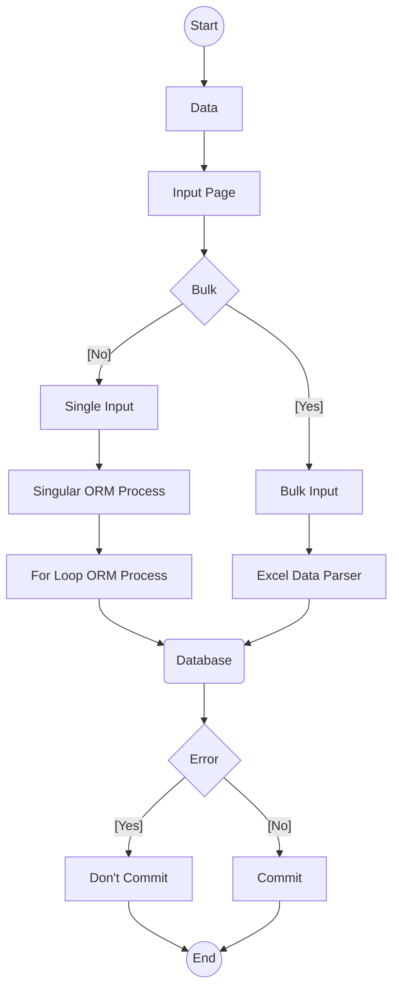

# Workflow plan for my app

```mermaid
flowchart TD
    A((Start))
    B[Data]
    C[Input Page]
    D{Bulk}
    E[Single Input]
    F[Bulk Input]
    G[Excel Data Parser]
    H[Singular ORM Process]
    I[For Loop ORM Process]
    J(Database)
    K{Error}
    L["Don't Commit"]
    M[Commit]
    END((End))

    A --> B --> C --> D
    D --[No]--> E --> H --> I --> J --> K
    D --[Yes]--> F --> G --> J
    K --[Yes]--> L --> END
    K --[No]--> M --> END
```